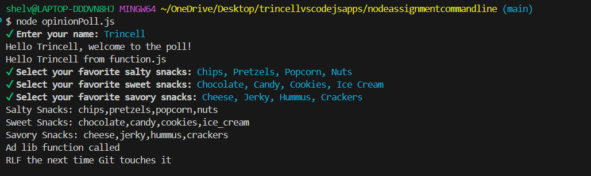

# nodeassignmentcommandline
This is a command line prompt opinion poll that allows you to select more than one option or just one with a toggle using the space bar, arrow keys, and pressing the letter "I" for everything to be selected. 

## Setup of the Project
- [ ] First, you will need to create a repository with the need to include a .gitignore with it. 
- [ ] Now that you have that setup, you will navigate to your project's terminal (bash or zsh) and run the following...

npm init
- [ ] add "type": "module" to the package.json file. This allows you to use the styling method of es6 with the imports to create your prompts. 
- [ ] Install Inquirer-
-- Navigate to: https://www.npmjs.com/package/@inquirer/prompts
From there, you will copy the following command and run it via your project's terminal to be able to setup the prompts:

npm install @inquirer/prompts
- [ ] Next you will create the necessary prompts needed for your project on your subject of choice. 
- [ ] Once you are done creating your prompts, you can run the poll by running the following as a node within the command terminal of your project:

node opinionPoll.js

Example Output:
